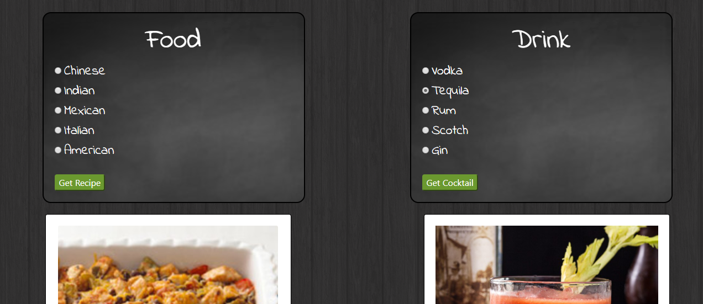

# Global Eats

## Description
Link to Application [here](https://kaykuhl.github.io/project-1/)

What should I eat?

This question has plagued all who have been stricken with hunger pains. But worry no longer! Through our Global Eats search options, food from around the world is just a few clicks away. Feel like a world renowned chef with recipes shaped around your cravings you have at any time!

Global Eats is a quick and easy way to find unique food and drink recipes from different culinary backgrounds through a few simple clicks!

## Concept: User-Story
As a busy professional, working full-time while going to school in the evenings, I find myself strapped for time yet I still enjoy cooking myself a unique meal and pouring myself a fun cocktail in the evenings. However, due to my busy lifestyle I don’t always know what cuisine I’ll be in the mood for. I could really use an application to satisfy my whimsical palette providing me with a new meal and drink to satisfy my cravings. 

## Process
#### Technology
- HTML
- CSS
- jQuery
- AJAX
- APIs (The Cocktail DB and Edamam)
- Animate.css

#### Tasks and roles:
- Front-End: Baraka, Mohamed, Issa
- Back-End: Kayla, Ashley, Issa
- README: Issa, Ashley
- Presentation: Whole Team

#### Challenges: 
  - Getting started and determining how to divide up the work

#### Successes:
  - Traversing through each API and randomizing the selections based on the users choice

## Directions for the Future
- Partner with food delivery services to provide take out options for those who can’t cook due to time constraints.
- Link video tutorials for recipes for both the food and drink options.
- Add maps options to the local restaurant that matches your food choice
- Have local storage on the page so that you search history saves on the page.
- Work on possible ways to fix some API pull issues faced in the page.
- Create a search function that is able to pull specific requests

Sample of page:
